# Bounded Multi-Source Shortest Path

This repository is a reading companion for **Bounded Multi-Source Shortest Path (BMSSP)**, a recursive shortest-path subroutine from recent directed SSSP research.

[Turkish README](README_TR.md) · [References](docs/references.md) · [License](LICENSE)

BMSSP stands for **Bounded Multi-Source Shortest Path**. It is a recursive subroutine used in recent theoretical work on directed single-source shortest paths with non-negative real edge weights.

This repository does not claim to invent BMSSP or improve the paper. It is a documentation project:

> Explain BMSSP visually, intuitively, and technically enough that students, engineers, and researchers can read the paper with less friction.

What it is not: a benchmark suite, a production implementation, or a replacement for the original proof.

## 41 Years Of Shortest Path Evolution

In 1984, Fredman and Tarjan showed how Fibonacci heaps could support Dijkstra-style shortest paths in `O(m + n log n)` time for non-negative edge weights. For decades, that sorting-like priority queue barrier shaped how people thought about comparison-based shortest path algorithms.

The BMSSP framework matters because it appears inside a modern theoretical algorithm that reorganizes shortest path discovery around:

- bounded distance regions,
- multiple frontier sources,
- recursive decomposition,
- pivot vertices,
- batched priority queue operations,
- and carefully controlled relaxation work.

It is advanced because it is not just "Dijkstra with a different heap." It changes the shape of the search.

My own reading note: BMSSP started making sense when I stopped looking for "the next minimum vertex" and instead looked for "the next bounded region that can be safely delegated to a smaller recursive call."

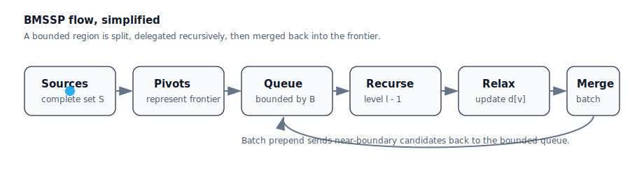

Additional visual notes:

| Concept | Animation |
|---|---|
| Bounded search | 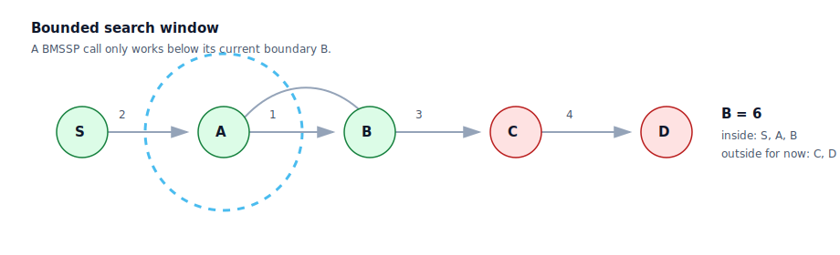 |
| Pivot selection | 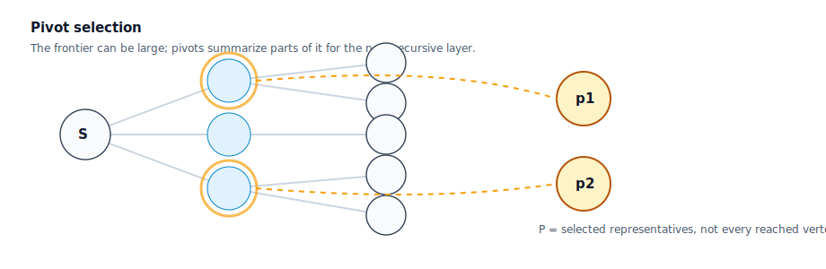 |
| Relaxation placement | 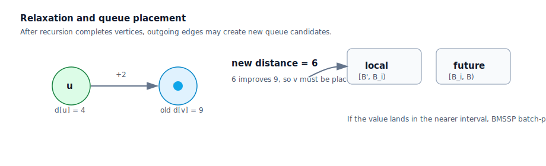 |
| Recursive slices | 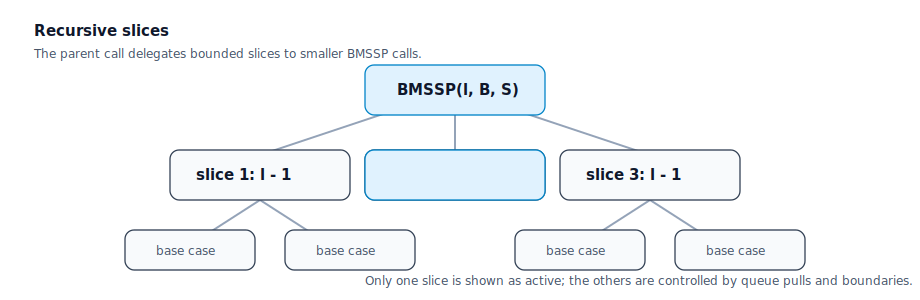 |

---

## Repository Map

```text
.
├── README.md
├── docs/
│   ├── algorithm-walkthrough.md
│   ├── glossary.md
│   ├── shortest-path-primer.md
│   ├── visual-architecture.md
│   ├── paper-reading-guide.md
│   └── references.md
├── images/
│   ├── README.md
│   ├── diagram-graph-basics.md
│   ├── diagram-recursion-tree.md
│   └── diagram-bounded-queue.md
├── pseudocode/
│   ├── bmssp-academic.md
│   ├── bmssp-beginner.md
│   ├── basecase.md
│   └── find-pivots.md
├── comparisons/
│   ├── dijkstra-vs-bmssp.md
│   └── algorithm-family-table.md
├── complexity-analysis/
│   ├── complexity-overview.md
│   ├── memory-usage.md
│   └── why-recursion-helps.md
├── visualizations/
│   ├── README.md
│   ├── bmssp-flow.svg
│   ├── bounded-window.svg
│   ├── pivot-selection.svg
│   ├── relaxation-cycle.svg
│   ├── recursive-slices.svg
│   ├── storyboard.md
│   └── frames.md
├── examples/
│   ├── small-graph-example.md
│   ├── multi-source-example.md
│   └── bounded-search-example.md
├── CONTRIBUTING.md
└── LICENSE
```

---

## What Is Shortest Path?

A **graph** is a collection of objects and relationships.

| Term | Meaning | Example |
|---|---|---|
| Node / vertex | A point in a graph | A city, router, page, account |
| Edge | A connection between nodes | A road, link, citation, transaction |
| Weight | Cost of using an edge | Distance, time, latency, risk |
| Path | A sequence of connected edges | `A -> B -> C` |
| Shortest path | Minimum-total-weight path | Fastest route from one city to another |

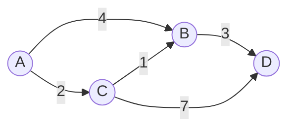

The shortest path from `A` to `D` is:

```text
A -> C -> B -> D
cost = 2 + 1 + 3 = 6
```

### Single-Source Shortest Path

Single-source shortest path asks:

> From one source `s`, what is the shortest distance to every reachable vertex?

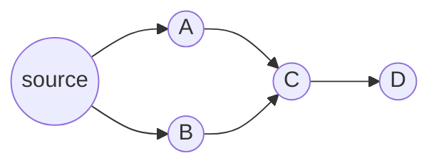

### Multi-Source Shortest Path

Multi-source shortest path asks:

> From a set of sources `S`, what is the shortest distance to every reachable vertex from the nearest source?

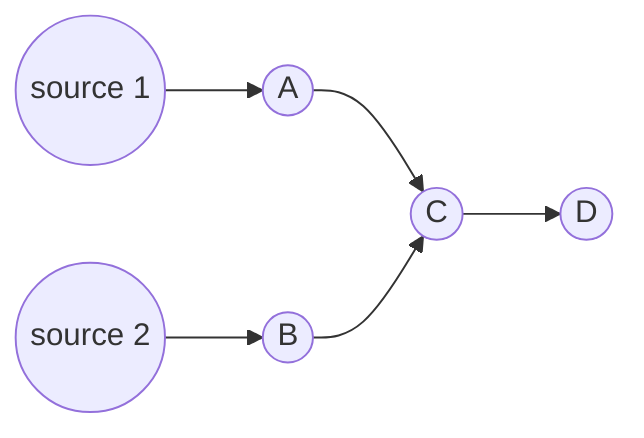

BMSSP works with a **set of already-complete vertices** as its sources. It then explores only vertices whose distances are below a boundary `B`.

---

## Dijkstra Vs BMSSP

| Feature | Dijkstra | BMSSP |
|---|---|---|
| Primary shape | One global greedy loop | Recursive bounded subproblems |
| Sources | Usually one source | Multiple sources `S` |
| Search range | Expands until queue is empty or target found | Restricted by boundary `B` |
| Priority structure | Standard priority queue | Specialized batched structure `D` |
| Decomposition | Flat | Hierarchical |
| Main operation | Extract-min, relax edges | Pull batch, recurse, relax, reinsert |
| Pivot system | Not present | Finds pivots to control recursion |
| Best for teaching | Intuitive first SSSP algorithm | Advanced research-level SSSP subroutine |
| Complexity role | Classical baseline | Component in a faster theoretical framework |

### How Dijkstra Thinks

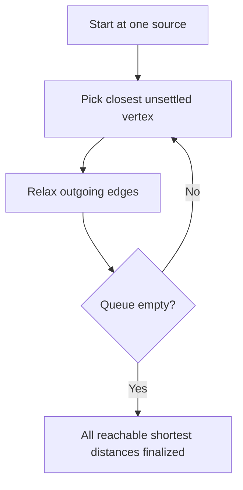

### How BMSSP Thinks

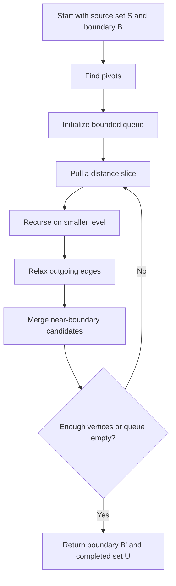

Dijkstra is a full search strategy. BMSSP is best understood as a carefully bounded recursive procedure inside a larger shortest path algorithm.

---

## BMSSP Core Idea

The shortest version:

> **Split -> Queue -> Recurse -> Relax -> Merge**

| Stage | Intuition | Why it exists |
|---|---|---|
| Split | Choose pivots that summarize useful frontier regions | Avoid expanding every candidate at the same level |
| Queue | Store pivot candidates under boundary `B` | Control the next distance slice |
| Recurse | Solve a smaller bounded problem | Create hierarchy instead of a flat global scan |
| Relax | Push improved distances along outgoing edges | Same shortest path heart as Dijkstra |
| Merge | Reinsert candidates that belong to the current distance slice | Preserve work while keeping recursion bounded |


---

## A Small Example I Use To Think About It

Here is a tiny graph where the boundary idea is visible without much notation:

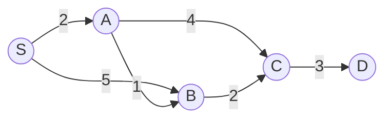

From `S`, the distances are:

| Vertex | Best known route | Distance |
|---|---|---:|
| `A` | `S -> A` | `2` |
| `B` | `S -> A -> B` | `3` |
| `C` | `S -> A -> B -> C` | `5` |
| `D` | `S -> A -> B -> C -> D` | `8` |

If a BMSSP call has boundary `B = 6`, then `A`, `B`, and `C` are in the active region, while `D` is outside for now. That one detail is easy to miss in the pseudocode: the algorithm is not trying to settle the whole graph inside every call.

The first mistake I made while reading the algorithm was treating `B` like a final answer. It is not. It is a local ceiling for the current call. The returned `B'` is the part the caller can trust after that slice of work finishes.

With two sources, the picture changes:

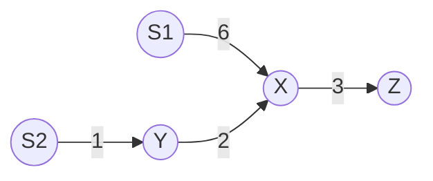

The best route to `X` is not from `S1`; it is `S2 -> Y -> X` with cost `3`. This is why the "multi-source" part matters: a BMSSP call treats several completed vertices as valid entry points into the same bounded region.

---

## Full Algorithm Explanation

The paper-level BMSSP procedure has this interface:

```text
BMSSP(l, B, S)
```

| Parameter | Meaning |
|---|---|
| `l` | recursion level |
| `B` | upper distance boundary |
| `S` | set of complete source vertices for this call |

It returns:

| Return value | Meaning |
|---|---|
| `B' <= B` | refined boundary reached by this call |
| `U` | vertices completed by this call |

### Block 1: Preconditions

```text
requirement 1: |S| <= 2^(l t)
requirement 2: every incomplete x with d(x) < B
               has a shortest path visiting some complete y in S
```

How I read this condition:

- Limits how many sources a recursive call can receive.
- Ensures the current source set is sufficient to discover all relevant vertices below `B`.

The reason it matters:

- The recursion needs a size invariant.
- Without the path coverage condition, the bounded search could miss vertices whose shortest path enters the region from somewhere else.

Effect on the analysis:

- Keeps recursive branching controlled.
- Allows the analysis to charge work to bounded sets rather than the entire graph each time.

### Block 2: Base Case

```text
if l = 0 then
    return B', U <- BaseCase(B, S)
```

At the bottom level:

- Stops recursion at level `0`.
- Solves the smallest bounded problem directly.

Why it is there:

- Every recursive algorithm needs a local terminal case.
- At small scale, direct relaxation is simpler than more decomposition.

Cost intuition:

- Prevents infinite recursion.
- Concentrates low-level work into a bounded primitive.

### Block 3: Find Pivots

```text
P, W <- FindPivots(B, S)
```

This is the first real split:

- Computes pivot vertices `P`.
- Computes an auxiliary set `W` of vertices relevant to the final return step.

The useful idea:

- Pivots are representatives for frontier regions.
- They prevent the algorithm from treating every discovered vertex as equally important at every level.

Why it helps the bound:

- Pivot selection is one of the key mechanisms that keeps recursive calls small.

### Block 4: Initialize The Bounded Queue

```text
D.Initialize(M, B) with M = 2^((l - 1)t)
D.Insert((x, d[x])) for x in P
```

Queue setup:

- Creates a bounded priority-like data structure `D`.
- Inserts each pivot with its current tentative distance.

Why not just use a normal queue:

- `D` organizes work by distance ranges below `B`.
- It supports batched operations that the analysis can bound.

Analysis angle:

- Replaces one global priority queue with bounded, batched queue behavior.

### Block 5: Main Recursive Loop

```text
i <- 0
B'_0 <- min_{x in P} d[x]
U <- empty

while |U| < k 2^(l t) and D is non-empty do
    i <- i + 1
    B_i, S_i <- D.Pull()
    B'_i, U_i <- BMSSP(l - 1, B_i, S_i)
    U <- U union U_i
```

Loop behavior:

- Pulls the next bounded batch from `D`.
- Recursively solves a smaller BMSSP problem.
- Adds completed vertices into `U`.

Why the loop is shaped this way:

- The algorithm advances by distance slices.
- Each recursive call handles a smaller, structured region.

What the stop condition protects:

- The stop condition prevents one call from consuming too much work.
- The recursion tree is shaped by the parameters `k`, `t`, and `l`.

### Block 6: Edge Relaxation

```text
K <- empty
for edge e = (u, v) where u in U_i do
    if d[u] + w_uv <= d[v] then
        d[v] <- d[u] + w_uv
```

This is the familiar part:

- Examines outgoing edges of vertices completed by the recursive call.
- Improves tentative distances for neighbors.

Shortest-path reason:

- This is the core shortest path operation.
- BMSSP still depends on relaxation, just as Dijkstra does.

Where the work is charged:

- Work is charged to edges leaving completed sets.
- The bounded structure aims to avoid repeatedly processing too much irrelevant frontier.

### Block 7: Reinsert Or Batch Locally

```text
if d[u] + w_uv in [B_i, B) then
    D.Insert((v, d[u] + w_uv))
else if d[u] + w_uv in [B'_i, B_i) then
    K <- K union {(v, d[u] + w_uv)}

D.BatchPrepend(K union {(x, d[x]) : x in S_i and d[x] in [B'_i, B_i)})
```

After a distance improves:

- If a relaxed vertex belongs to a future slice, insert it into `D`.
- If it belongs to the just-opened lower slice, collect it in `K`.
- Batch-prepend near-boundary candidates back into the queue.

Why the intervals matter:

- The algorithm must not lose candidates that become relevant after recursion refines the boundary.
- Batch insertion avoids paying for many individual queue operations when a grouped operation is possible.

Batched operation payoff:

- This is where the specialized queue matters.
- Batched queue updates are central to the theoretical accounting.

### Block 8: Return Boundary And Completed Set

```text
return B' <- min{B'_i, B}
       U <- U union {x in W : d[x] < B'}
```

Return value:

- Returns the best lower boundary discovered.
- Adds eligible vertices from `W` that fall below the returned boundary.

Why the caller needs it:

- The caller needs both a distance boundary and a set of completed vertices.
- `W` allows useful vertices found during pivot discovery to be included at the correct moment.

Invariant preserved:

- Keeps completion aligned with the refined boundary.
- Helps maintain the invariant expected by parent recursive calls.

---

## Visual Architecture

### Recursion Flow

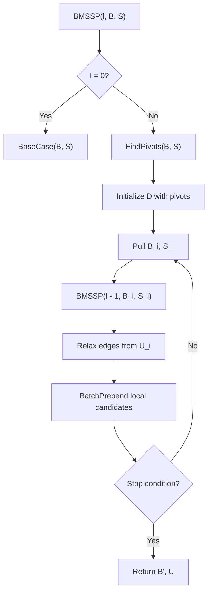

### Queue System

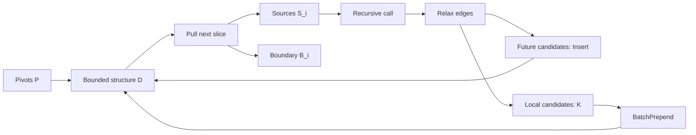

### Pivot Selection

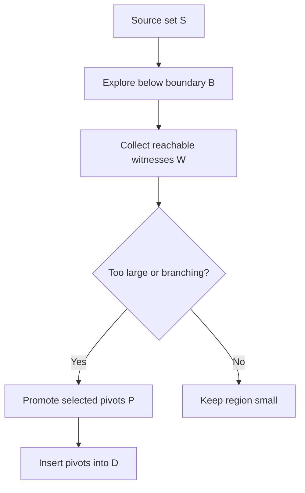

### Edge Relaxation Flow

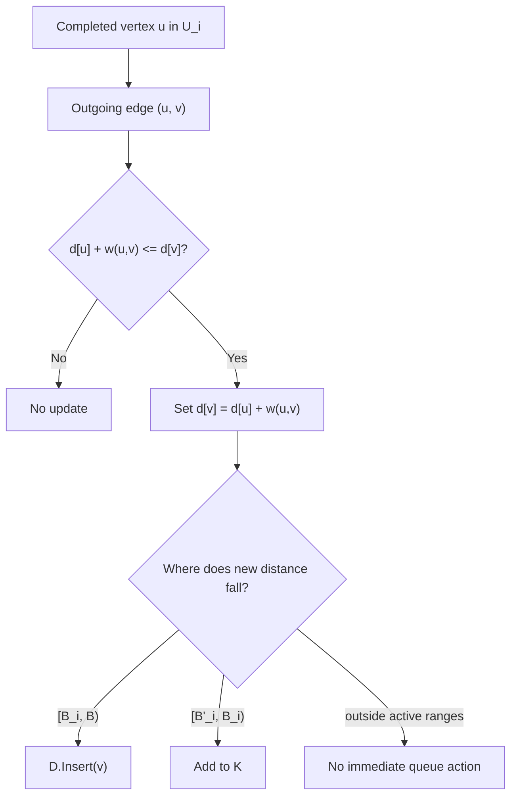

### Recursive Decomposition

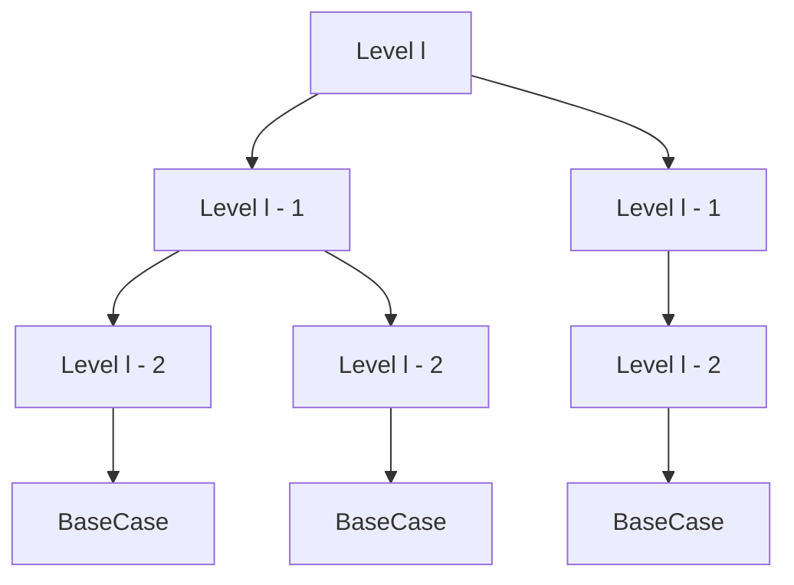

---

## Complexity Analysis

The BMSSP subroutine is analyzed as part of a larger deterministic directed SSSP algorithm for graphs with non-negative real edge weights.

At a high level, the paper presents a bound of the form:

```text
O(m log^(2/3) n)
```

for the full SSSP framework under its model and parameter choices.

This repository does not independently prove the bound. It explains the algorithmic ideas that make such an analysis possible.

### Why The Bound Is Nontrivial

Dijkstra's algorithm repeatedly asks a global question:

> Which unsettled vertex has the smallest tentative distance?

BMSSP tries to avoid paying for a globally sorted view at every step. It uses:

- bounded search windows,
- recursive subproblems,
- pivot filtering,
- and batched data structure operations.

### Memory Usage

BMSSP needs memory for:

- distance estimates `d[x]`,
- graph adjacency lists,
- recursive call state,
- pivot sets `P`,
- witness sets `W`,
- completed sets `U`,
- temporary candidate sets `K`,
- and the bounded data structure `D`.

In practical educational implementations, memory is likely dominated by:

```text
graph storage + distance array + queue/candidate sets
```

### Why Recursive Graph Algorithms Matter

Recursive graph algorithms are useful when a problem can be decomposed into smaller structured regions. BMSSP uses recursion not as decoration, but as a way to:

- localize search,
- enforce size bounds,
- reuse source-set invariants,
- and reduce dependence on one global priority order.

See [complexity-analysis/complexity-overview.md](complexity-analysis/complexity-overview.md) for a deeper walkthrough.

---

## Real World Uses

Shortest path algorithms appear everywhere:

| Domain | Use |
|---|---|
| Navigation systems | Fastest or shortest routes through roads |
| Internet routing | Low-latency or low-cost packet paths |
| GPU graph processing | Large-scale frontier expansion and relaxation |
| Road networks | Hierarchical routing over sparse graphs |
| Distributed systems | Service routing, placement, dependency paths |
| Graph databases | Reachability, recommendations, weighted traversal |

BMSSP itself is best viewed today as a research-level shortest path idea. Its design may influence future work on:

- theoretical SSSP,
- cache-aware graph search,
- parallel bounded frontiers,
- batched priority queues,
- and hierarchical routing systems.

---

## Beginner Version

This pseudocode intentionally removes most paper-level details:

```text
BMSSP_Beginner(level, boundary, sources):
    if level is 0:
        directly solve a small bounded shortest path problem
        return new_boundary, completed_vertices

    pivots, witnesses = choose important frontier vertices(sources, boundary)
    queue = bounded queue ordered by distance
    queue.add_all(pivots)

    completed = empty set

    while queue is not empty and completed is not too large:
        next_boundary, next_sources = queue.pull_next_distance_slice()

        child_boundary, child_completed =
            BMSSP_Beginner(level - 1, next_boundary, next_sources)

        completed.add_all(child_completed)

        for each edge leaving child_completed:
            if the edge improves a neighbor distance:
                update the neighbor distance

                if the neighbor belongs to a future slice:
                    queue.insert(neighbor)
                else if the neighbor belongs to the current slice:
                    remember it for batch insertion

        queue.batch_prepend(current_slice_candidates)

    return best_boundary_found, completed plus safe witnesses
```

The intuition:

> Do not explore the whole graph at once. Explore bounded regions, recursively refine them, and batch the frontier work.

More beginner pseudocode lives in [pseudocode/bmssp-beginner.md](pseudocode/bmssp-beginner.md).

---

## Future Improvements And Research Directions

These are possible research directions, not claims made by this repository:

| Direction | Question |
|---|---|
| Adaptive pivots | Can pivot choice respond to graph structure dynamically? |
| GPU acceleration | Can bounded frontiers map well to SIMT execution? |
| Parallel processing | Can independent recursive slices be processed concurrently? |
| Cache optimization | Can adjacency access be reorganized for locality? |
| Hierarchical routing | Can BMSSP-style decomposition inform road-network preprocessing? |
| Practical variants | Which parts of the theoretical design survive real-world constant factors? |

Asymptotic improvements do not automatically imply faster wall-clock performance on ordinary workloads. Engineering details matter.

---

## Reading Path

1. Start with [docs/shortest-path-primer.md](docs/shortest-path-primer.md).
2. Read [comparisons/dijkstra-vs-bmssp.md](comparisons/dijkstra-vs-bmssp.md).
3. Walk through [docs/algorithm-walkthrough.md](docs/algorithm-walkthrough.md).
4. Study [pseudocode/bmssp-academic.md](pseudocode/bmssp-academic.md).
5. Review [complexity-analysis/complexity-overview.md](complexity-analysis/complexity-overview.md).

---

## References

- Ran Duan, Jiayi Mao, Xiao Mao, Xinkai Shu, and Longhui Yin, ["Breaking the Sorting Barrier for Directed Single-Source Shortest Paths"](https://arxiv.org/abs/2504.17033), arXiv:2504.17033.
- [dblp record](https://dblp.org/rec/journals/corr/abs-2504-17033) for bibliographic metadata.

## Attribution

BMSSP is discussed here as an algorithmic idea from the academic shortest path literature, especially the paper commonly referenced as **"Breaking the Sorting Barrier for Directed Single-Source Shortest Paths"** by Duan, Mao, Mao, Shu, and Yin.

This repository is an explanatory companion, not an implementation claiming authorship or novelty.

## License

MIT. See [LICENSE](LICENSE).
