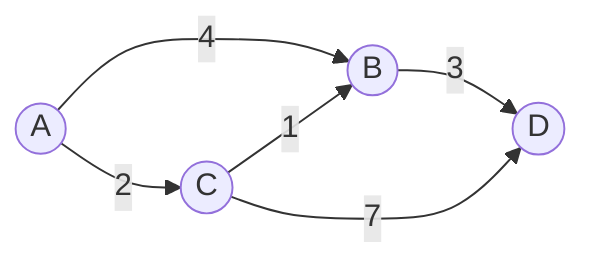
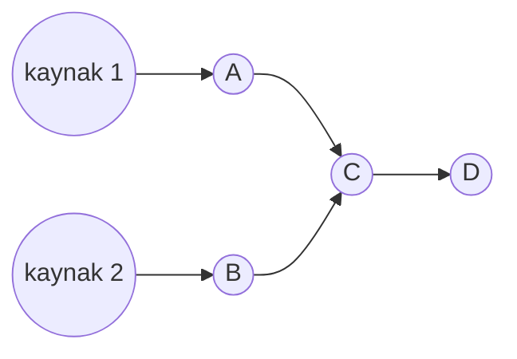
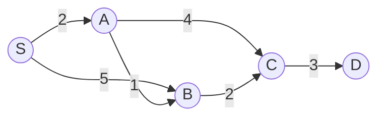
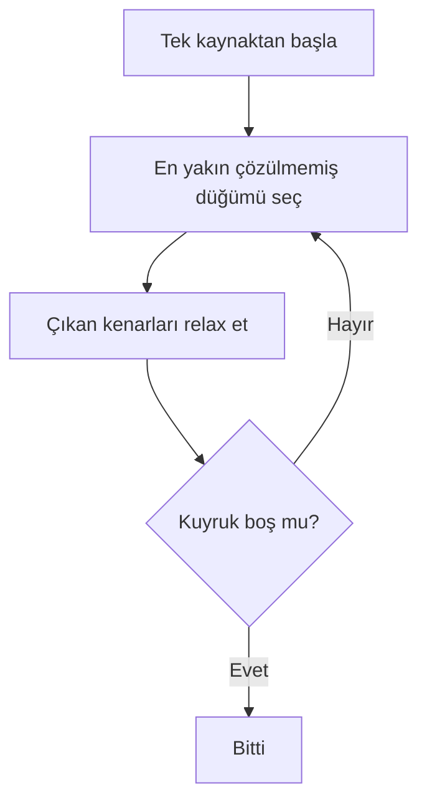
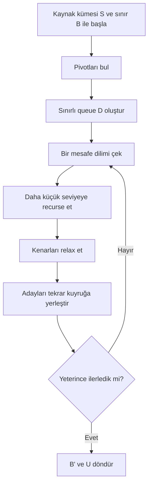

# Bounded Multi-Source Shortest Path

> **Bounded Multi-Source Shortest Path (BMSSP)** algoritmasını akademik makale okuması için sadeleştiren Türkçe dokümantasyon.

[English README](README.md) · [Kaynaklar](docs/references.md) · [Lisans](LICENSE)

BMSSP, **Bounded Multi-Source Shortest Path** ifadesinin kısaltmasıdır. Türkçeye yaklaşık olarak **Sınırlı Çok Kaynaklı En Kısa Yol** şeklinde çevrilebilir.

Bu repo yeni bir algoritma icat ettiğini iddia etmez. Kısa haliyle amaç:

- BMSSP fikrini anlaşılır hale getirmek,
- akademik makaledeki yoğun notasyonu sadeleştirmek,
- shortest path kavramlarını öğretmek,
- Dijkstra ile BMSSP arasındaki farkları göstermek,
- araştırma okuması yapmak isteyenler için görsel bir başlangıç noktası sunmak.

Bu çalışma bir benchmark ya da üretim implementasyonu değildir. Teorem, kanıt ve kesin parametreler için orijinal akademik makale kaynak alınmalıdır.

---

## 41 Yıllık Shortest Path Evrimi

1984 yılında Fredman ve Tarjan, Fibonacci heap kullanarak Dijkstra tarzı en kısa yol algoritmaları için klasik `O(m + n log n)` sınırını ortaya koydu. Bu çizgi uzun süre karşılaştırma tabanlı shortest path algoritmalarının düşünülme biçimini etkiledi.

BMSSP’nin önemli olmasının nedeni, güncel teorik çalışmalarda shortest path aramasını farklı bir yapıya taşımasıdır:

- tek bir global öncelik kuyruğu yerine sınırlı bölgeler,
- tek kaynak yerine çoklu tamamlanmış kaynaklar,
- düz arama yerine özyinelemeli alt problemler,
- tüm frontier yerine pivot sistemi,
- tek tek işlem yerine batch queue operasyonları.

Kısacası BMSSP, “Dijkstra ama farklı heap ile” gibi düşünülmemelidir. Aramanın organizasyonunu değiştirir.

Benim için BMSSP’nin oturduğu nokta şuydu: algoritma sürekli “en küçük düğüm hangisi?” diye sormuyor; “bu sınırın altında hangi bölgeyi daha küçük bir probleme güvenle devredebilirim?” diye düşünüyor.


Ek görsel notlar:

| Kavram | Animasyon |
|---|---|
| Sınırlı arama |  |
| Pivot seçimi |  |
| Relaxation sonrası yerleştirme |  |
| Recursive dilimler |  |

---

## Shortest Path Nedir?

Bir **graf**, noktalar ve bağlantılardan oluşur.

| Terim | Anlamı | Örnek |
|---|---|---|
| Node / vertex | Graf üzerindeki nokta | Şehir, router, sayfa |
| Edge | İki nokta arasındaki bağlantı | Yol, link, ilişki |
| Weight | Kenarın maliyeti | Mesafe, süre, gecikme |
| Path | Bağlantılı kenarlar dizisi | `A -> B -> C` |
| Shortest path | Toplam maliyeti en düşük yol | En hızlı rota |



`A` noktasından `D` noktasına en kısa yol:

```text
A -> C -> B -> D
maliyet = 2 + 1 + 3 = 6
```

## Multi-Source Shortest Path

Klasik shortest path probleminde genelde tek kaynak vardır:

```text
source = s
```

Multi-source versiyonda ise kaynak kümesi vardır:

```text
S = {s1, s2, s3, ...}
```

Amaç, her noktaya bu kaynaklardan en yakını üzerinden ulaşmaktır.



BMSSP, bir `S` kaynak kümesi ve bir `B` sınırı ile çalışır:

```text
S = tamamlanmış kaynak düğümleri
B = bu çağrıda ilgilenilen üst mesafe sınırı
```

## Küçük Bir Örnek

Şu graf, bounded search fikrini çok sade gösteriyor:



`S` kaynağından mesafeler:

| Düğüm | En iyi rota | Mesafe |
|---|---|---:|
| `A` | `S -> A` | `2` |
| `B` | `S -> A -> B` | `3` |
| `C` | `S -> A -> B -> C` | `5` |
| `D` | `S -> A -> B -> C -> D` | `8` |

Eğer bir BMSSP çağrısında sınır `B = 6` ise `A`, `B` ve `C` aktif bölgede kalır; `D` bu çağrı için dışarıdadır. Pseudocode okurken bu ayrım önemli: her çağrı bütün grafı çözmeye çalışmaz.

İlk okurken yaptığım hata `B` değerini nihai cevap gibi düşünmekti. Aslında `B`, o çağrının yerel üst sınırı. Çağrı bittikten sonra dönen `B'`, üst seviyenin güvenle kullanacağı daha dar sınırı temsil ediyor.

---

## Dijkstra Ve BMSSP Karşılaştırması

| Özellik | Dijkstra | BMSSP |
|---|---|---|
| Arama şekli | Tek global greedy döngü | Sınırlı özyinelemeli alt problemler |
| Kaynak sayısı | Genellikle tek kaynak | Çoklu kaynak kümesi `S` |
| Arama alanı | Kuyruk bitene kadar genişler | `B` sınırının altında kalır |
| Veri yapısı | Standart priority queue | Sınırlı ve batch çalışan yapı `D` |
| Pivot sistemi | Yok | Var |
| Hiyerarşi | Düz | Katmanlı / recursive |
| Öğrenme seviyesi | Başlangıç-orta | İleri seviye araştırma |

Dijkstra şöyle düşünür:



BMSSP şöyle düşünür:



---

## BMSSP’nin Ana Fikri

En kısa özet:

> **Split -> Queue -> Recurse -> Relax -> Merge**

| Aşama | Sezgisel anlamı | Neden var? |
|---|---|---|
| Split | Frontier içinden pivotlar seç | Her düğümü aynı seviyede işlememek için |
| Queue | Adayları sınır altında organize et | Sonraki mesafe dilimini kontrol etmek için |
| Recurse | Daha küçük problemi çöz | Düz arama yerine hiyerarşi kurmak için |
| Relax | Kenarlardan yeni mesafeler üret | Shortest path algoritmalarının temel operasyonu |
| Merge | Yeni adayları geri ekle | Frontier bilgisini kaybetmemek için |


---

## Akademik Pseudocode Nasıl Okunur?

BMSSP çağrısı şu şekildedir:

```text
BMSSP(l, B, S)
```

| Parametre | Anlamı |
|---|---|
| `l` | Özyineleme seviyesi |
| `B` | Üst mesafe sınırı |
| `S` | Tamamlanmış kaynak düğümleri |

Döndürdüğü değerler:

| Değer | Anlamı |
|---|---|
| `B' <= B` | Yeni / rafine sınır |
| `U` | Bu çağrıda tamamlanan düğümler |

### 1. Base Case

```text
if l = 0 then
    return BaseCase(B, S)
```

Özyineleme seviyesi sıfıra indiğinde algoritma artık parçalamaz, küçük problemi doğrudan çözer.

### 2. Pivot Bulma

```text
P, W <- FindPivots(B, S)
```

`P`, frontier içinden seçilen pivotları temsil eder. `W`, daha sonra tamamlanmış kümeye eklenebilecek yardımcı düğümleri tutar.

### 3. Sınırlı Queue

```text
D.Initialize(M, B)
D.Insert((x, d[x])) for x in P
```

`D`, yalnızca `B` sınırının altındaki adayları yöneten özel bir veri yapısıdır.

### 4. Recursive Dilimler

```text
B_i, S_i <- D.Pull()
B'_i, U_i <- BMSSP(l - 1, B_i, S_i)
```

Algoritma bir sonraki mesafe dilimini çeker, onu daha küçük bir BMSSP çağrısına verir ve dönen tamamlanmış düğümlerle devam eder.

### 5. Relaxation

```text
if d[u] + w_uv <= d[v]:
    d[v] <- d[u] + w_uv
```

Bu, Dijkstra’daki temel fikirle aynıdır: `u` üzerinden `v` noktasına daha ucuz gidilebiliyorsa mesafeyi güncelle.

### 6. Merge

Yeni mesafe hangi aralığa düşüyorsa aday ya gelecekte işlenecek şekilde `D` içine eklenir ya da yakın dilime batch olarak geri konur.

---

## Karmaşıklık

BMSSP, yönlü ve negatif olmayan ağırlıklı graflar için geliştirilen teorik bir SSSP çerçevesinin içinde yer alır.

Makaledeki tam framework için verilen sınır:

```text
O(m log^(2/3) n)
```

Bu repo bu sınırı yeniden kanıtlamaz. Sadece algoritmik fikri ve sezgiyi açıklar.

BMSSP’nin ileri seviye sayılmasının nedeni:

- recursive invariant gerektirmesi,
- pivot seçiminin correctness ile bağlantılı olması,
- queue operasyonlarının amortize analizle ele alınması,
- sınırların (`B`, `B'`) doğru korunmasının zor olmasıdır.

---

## Nerelerde İşe Yarar?

Shortest path algoritmaları birçok alanda temel yapı taşıdır:

| Alan | Kullanım |
|---|---|
| Navigasyon | En kısa / en hızlı rota |
| Ağ yönlendirme | Paketlerin düşük maliyetli rotası |
| GPU graph processing | Büyük frontier işlemleri |
| Road networks | Hiyerarşik rota planlama |
| Distributed systems | Servis bağımlılığı ve yönlendirme |
| Graph databases | Ağırlıklı traversal ve öneri |

BMSSP bugün daha çok teorik araştırma bağlamında düşünülmelidir; fakat bounded frontier, pivot ve batch processing fikirleri gelecekte pratik sistemlere ilham verebilir.

---

## Başlangıç İçin Basitleştirilmiş Pseudocode

```text
BeginnerBMSSP(level, boundary, sources):
    if level == 0:
        return solve_small_bounded_problem(boundary, sources)

    pivots, witnesses = find_frontier_representatives(boundary, sources)
    queue = bounded_queue(boundary)
    queue.insert_all(pivots)

    completed = empty set

    while queue is not empty and completed is not too large:
        next_boundary, next_sources = queue.pull_next_slice()

        child_boundary, child_completed =
            BeginnerBMSSP(level - 1, next_boundary, next_sources)

        completed.add_all(child_completed)

        for each edge leaving child_completed:
            if edge improves a neighbor distance:
                update distance
                put neighbor into the right queue slice

        queue.batch_prepend(local_candidates)

    return best_boundary, completed plus safe witnesses
```

---

## Araştırma Yönleri

Bunlar bu reponun iddiası değil, yalnızca olası araştırma sorularıdır:

| Yön | Soru |
|---|---|
| Adaptive pivots | Pivotlar graf yapısına göre dinamik seçilebilir mi? |
| GPU acceleration | Bounded frontier yapısı GPU’ya iyi map edilir mi? |
| Parallel processing | Bağımsız recursive dilimler paralel işlenebilir mi? |
| Cache optimization | Kenar erişimleri cache dostu hale getirilebilir mi? |
| Hierarchical routing | Road network routing için benzer hiyerarşi kullanılabilir mi? |

---

## Okuma Sırası

1. [docs/shortest-path-primer.md](docs/shortest-path-primer.md)
2. [comparisons/dijkstra-vs-bmssp.md](comparisons/dijkstra-vs-bmssp.md)
3. [docs/algorithm-walkthrough.md](docs/algorithm-walkthrough.md)
4. [pseudocode/bmssp-academic.md](pseudocode/bmssp-academic.md)
5. [complexity-analysis/complexity-overview.md](complexity-analysis/complexity-overview.md)

## Kaynak

- Ran Duan, Jiayi Mao, Xiao Mao, Xinkai Shu, and Longhui Yin, ["Breaking the Sorting Barrier for Directed Single-Source Shortest Paths"](https://arxiv.org/abs/2504.17033), arXiv:2504.17033.

Bu repo, BMSSP için eğitsel ve görsel bir açıklama çalışmasıdır.
