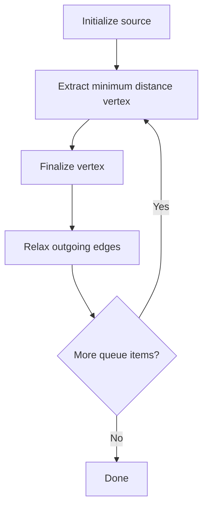
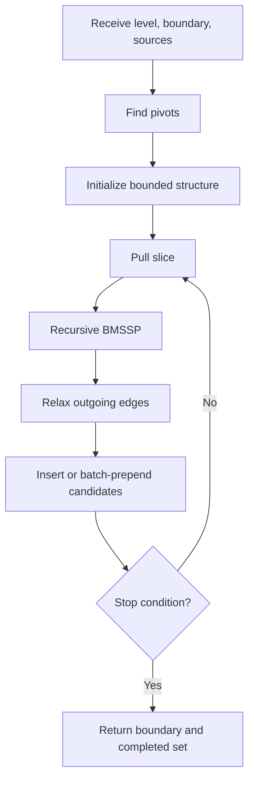

# Dijkstra Vs BMSSP

## Quick Comparison

| Feature | Dijkstra | BMSSP |
|---|---|---|
| Algorithm type | Full shortest path algorithm | Recursive shortest path subroutine |
| Typical source model | Single source | Multiple complete sources |
| Main data structure | Priority queue | Bounded batched queue-like structure |
| Search shape | Global greedy expansion | Bounded recursive expansion |
| Boundary parameter | Usually none | Central parameter `B` |
| Pivot selection | None | Central mechanism |
| Recursion | None | Yes |
| Teaching difficulty | Beginner/intermediate | Advanced |

## Dijkstra In One Picture

## BMSSP In One Picture

## Key Conceptual Difference

Dijkstra asks:

> What is the globally nearest unsettled vertex?

BMSSP asks:

> Within this bounded region, which structured slice should be recursively resolved next?

## When To Teach Which

Teach Dijkstra first when students need:

- relaxation,
- priority queues,
- non-negative edge shortest paths,
- correctness by greedy choice.

Teach BMSSP later when students are ready for:

- recursive invariants,
- advanced asymptotic analysis,
- batched data structures,
- and frontier decomposition.
