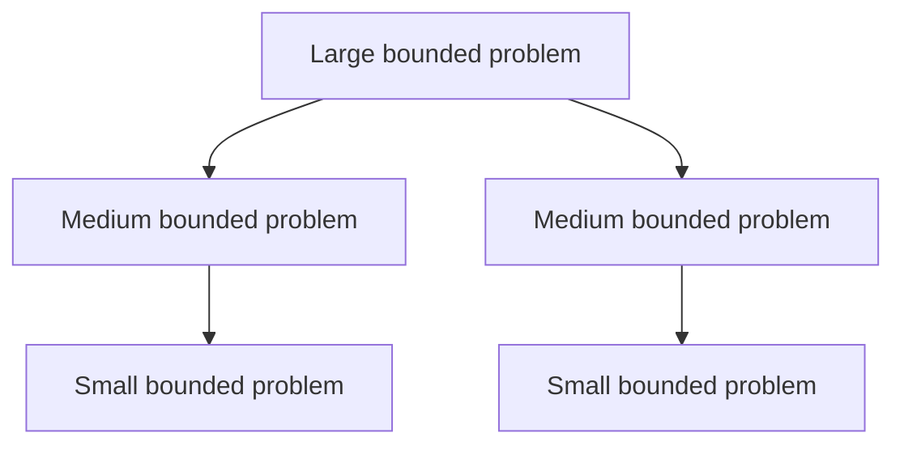

# Why Recursion Helps

BMSSP uses recursion to structure the shortest path search into bounded subproblems.

## Flat Search

Dijkstra-style search is flat:

This is simple and powerful, but it keeps asking a global ordering question.

## Recursive Search

BMSSP-style search is hierarchical:

The recursive structure helps:

- localize active vertices,
- limit source set sizes,
- process frontier ranges in batches,
- and separate near-term candidates from future candidates.

## The Tradeoff

Recursion adds complexity:

- more invariants,
- harder proofs,
- more state,
- and more implementation risk.

It is worthwhile in theory only because the bounds show that this added structure can reduce global ordering cost.
