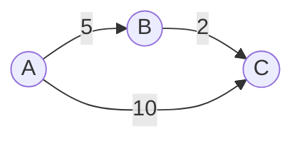
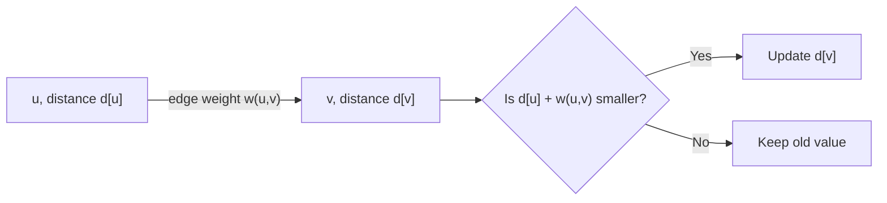
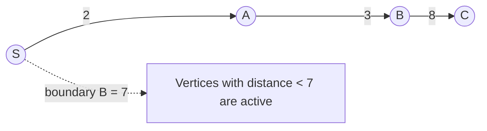
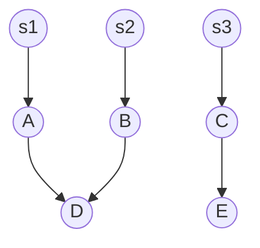

# Shortest Path Primer

This primer explains the graph vocabulary needed before reading BMSSP.

## Graphs

A graph is written as:

```text
G = (V, E)
```

where:

- `V` is the set of vertices,
- `E` is the set of edges.

For weighted shortest paths, every edge has a cost:

```text
w(u, v) >= 0
```

BMSSP is designed for directed graphs with non-negative edge weights in the setting discussed by the paper.



## Distance Estimates

Shortest path algorithms usually maintain an array:

```text
d[v] = best distance estimate currently known for vertex v
```

At the beginning:

```text
d[source] = 0
d[all other vertices] = infinity
```

For multi-source search:

```text
d[s] = known value for every source s in S
```

## Relaxation

Relaxation is the central operation:

```text
if d[u] + w(u, v) < d[v]:
    d[v] = d[u] + w(u, v)
```

It asks:

> If I go to `v` through `u`, did I find a cheaper route?



## Complete And Incomplete Vertices

Many shortest path algorithms distinguish between:

| State | Meaning |
|---|---|
| Complete | The algorithm knows the final shortest distance |
| Incomplete | The best known distance may still improve |

In BMSSP, recursive calls receive a set `S` of complete vertices. These vertices serve as trusted entry points into the bounded region.

## Boundaries

A boundary `B` means:

```text
Only care about vertices with distance below B.
```

This is the "bounded" in BMSSP.



If `d[C] = 13`, then `C` is outside the current bounded search.

## Multi-Source Search

Instead of one source, BMSSP works with a set:

```text
S = {s1, s2, s3, ...}
```

This lets the algorithm process a frontier made of multiple already-complete vertices.



The distance to a vertex is the best route from any source in the set.
