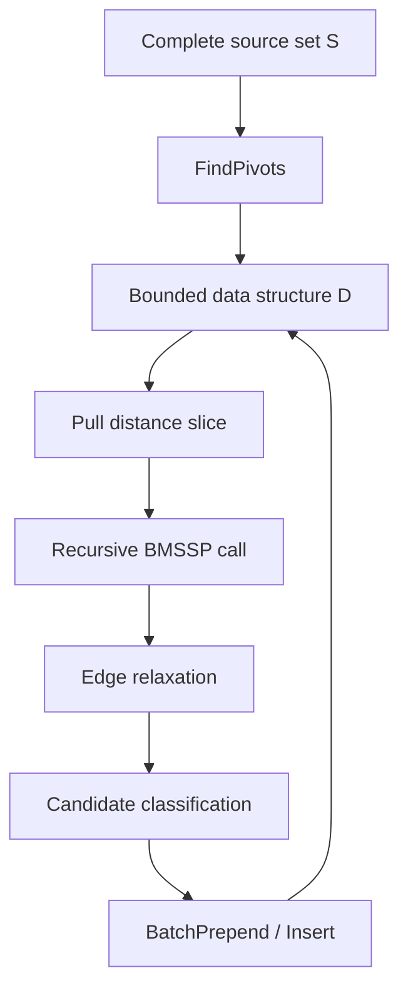
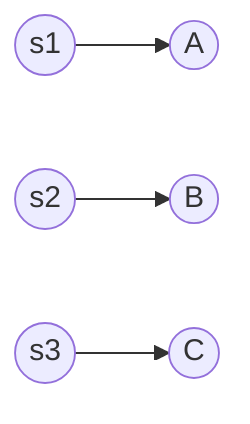
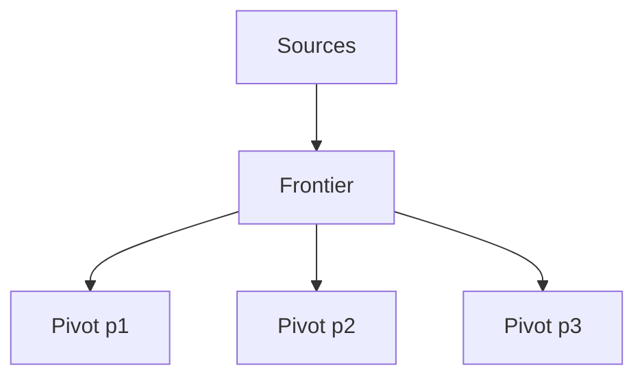
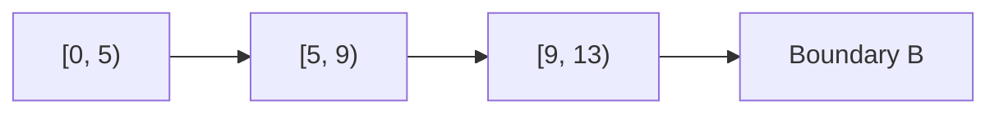
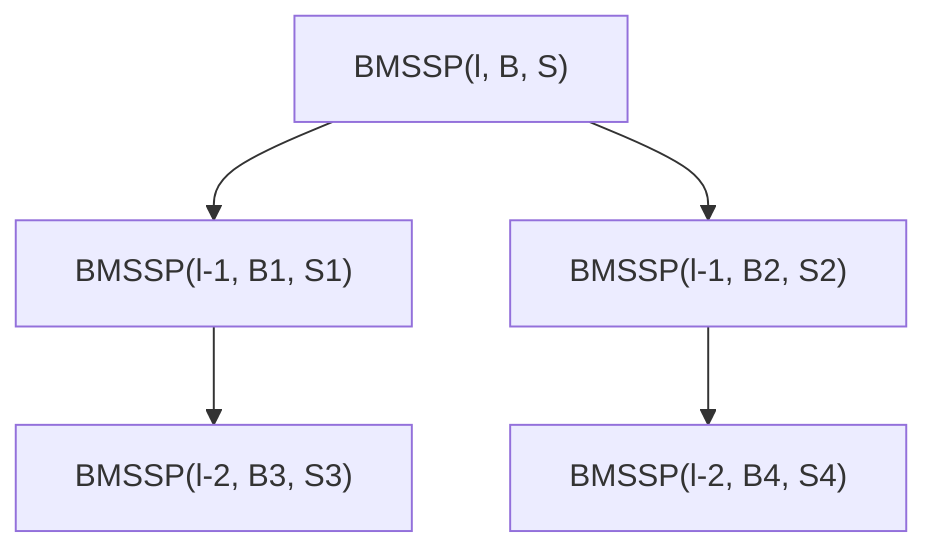

# Visual Architecture

BMSSP is easiest to understand as a machine made of five interacting parts.



## Component 1: Source Set

The source set `S` contains vertices whose distances are already trusted.



## Component 2: Boundary

The boundary `B` limits the current problem.

```text
Active region = vertices x where d[x] < B
```

## Component 3: Pivots

Pivots summarize useful frontier points.



## Component 4: Queue Slices

The bounded queue groups candidate vertices by distance ranges.



## Component 5: Recursive Calls

Each recursive call solves a smaller bounded problem.


