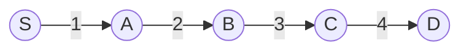

# Bounded Search Example

Bounded search means:

> Do shortest path work only below a chosen distance limit.

Consider:



Distances:

| Vertex | Distance |
|---|---:|
| `S` | `0` |
| `A` | `1` |
| `B` | `3` |
| `C` | `6` |
| `D` | `10` |

If:

```text
B = 5
```

then the active region contains:

```text
S, A, B
```

and excludes:

```text
C, D
```

BMSSP uses boundaries like this to keep recursive calls focused.
