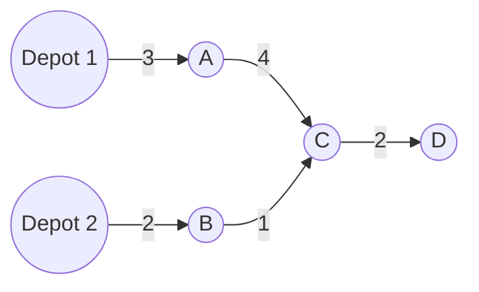

# Multi-Source Example

Suppose two emergency depots can reach a road network.



The distance to `C` is:

```text
min(distance from Depot 1 through A, distance from Depot 2 through B)
= min(3 + 4, 2 + 1)
= 3
```

So `Depot 2 -> B -> C` wins.

## BMSSP Connection

BMSSP receives a set `S` of complete vertices. These are like multiple trusted entry points into the next region.

```text
S = {Depot 1, Depot 2}
```

The algorithm then explores below a boundary:

```text
B = 6
```

Only vertices with distance less than `6` are relevant to that call.
