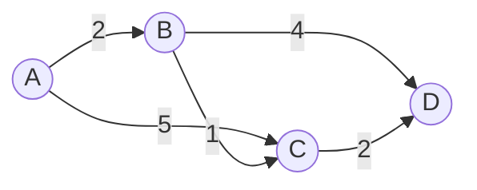

# Small Graph Example

Consider this weighted directed graph:



From source `A`:

| Vertex | Shortest distance |
|---|---:|
| `A` | `0` |
| `B` | `2` |
| `C` | `3` |
| `D` | `5` |

The shortest route to `D` is:

```text
A -> B -> C -> D
cost = 2 + 1 + 2 = 5
```

## What Dijkstra Does

1. Finalize `A`.
2. Relax `A -> B` and `A -> C`.
3. Finalize `B`.
4. Relax `B -> C` and `B -> D`.
5. Finalize `C`.
6. Relax `C -> D`.
7. Finalize `D`.

## What A BMSSP Lens Adds

BMSSP would not be useful on a graph this tiny, but the concepts still appear:

- `A` is a source.
- A boundary might say "only care below distance `4`."
- Vertices `A`, `B`, and `C` are inside that region.
- `D` may be outside until the boundary expands or a recursive call returns.
