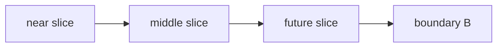

# Bounded Queue Diagram

Source note for a future `bounded-queue.png` export.

```mermaid
flowchart LR
    A["near slice"] --> B["middle slice"] --> C["future slice"] --> D["boundary B"]
```

Caption:

> BMSSP organizes candidate vertices inside a bounded distance range.
