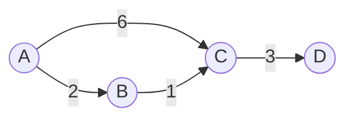

# Graph Basics Diagram

Source note for a future `graph-basics.png` export.

```mermaid
graph LR
    A((A)) -- "2" --> B((B))
    A -- "6" --> C((C))
    B -- "1" --> C
    C -- "3" --> D((D))
```

Caption:

> A weighted directed graph with four vertices and four edges.
