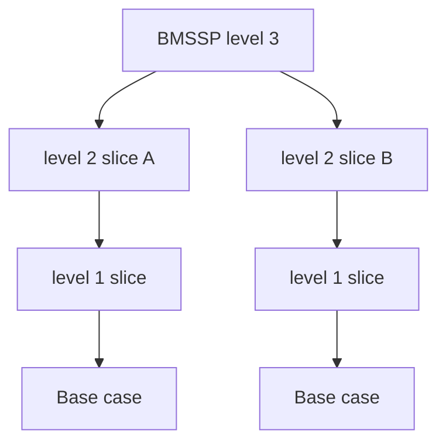

# Recursion Tree Diagram

Source note for a future `recursion-tree.png` export.

```mermaid
flowchart TD
    A["BMSSP level 3"] --> B["level 2 slice A"]
    A --> C["level 2 slice B"]
    B --> D["level 1 slice"]
    C --> E["level 1 slice"]
    D --> F["Base case"]
    E --> G["Base case"]
```
