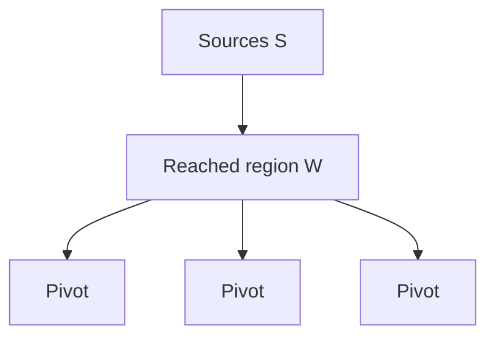

# FindPivots

`FindPivots(B, S)` identifies frontier representatives for a BMSSP call.

## Inputs

| Symbol | Meaning |
|---|---|
| `B` | Boundary |
| `S` | Complete source set |

## Outputs

| Symbol | Meaning |
|---|---|
| `P` | Pivot set |
| `W` | Witness/reachable set used later |

## Educational Sketch

```text
function FindPivots(boundary, sources):
    W = vertices reached from sources while staying below boundary

    if W is small:
        P = sources or selected local representatives
    else:
        P = vertices that represent large frontier growth

    return P, W
```

## Intuition

Pivots are a compression device. Instead of passing a large frontier into the next stage, BMSSP selects vertices that represent important branches of the search.



## Complexity Role

The pivot system helps maintain source-set size bounds across recursion levels.
